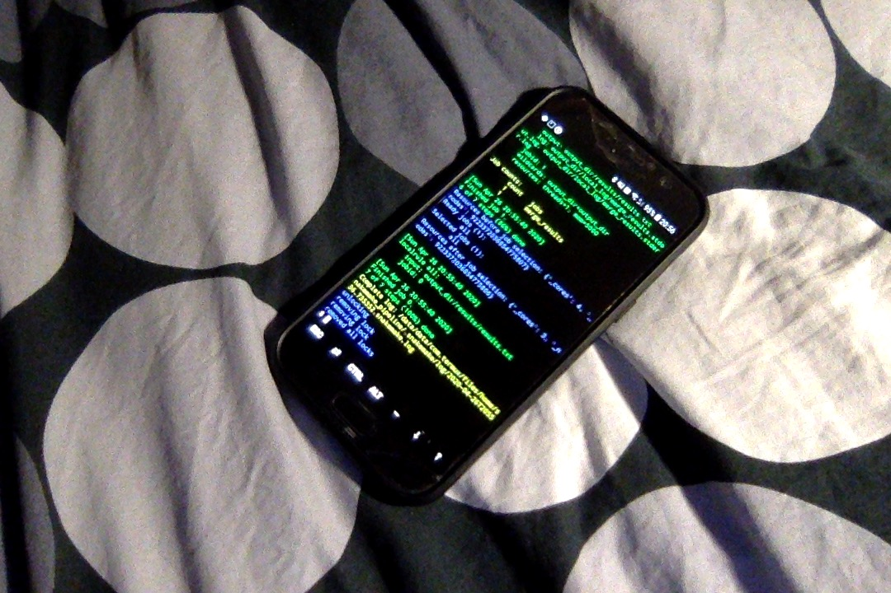

# Angry Computational Droid
*Maciej Bak*  
*Swiss Institute of Bioinformatics*

Short tutorial on how to turn your Android smartphone ( :iphone:) into a platform for scientific computing ( :robot:)  
No root required.  

The droid will have: 
* [GNU bash](https://www.gnu.org/software/bash/)
* [GNU make](https://www.gnu.org/software/make/)
* C and C++ compilers: [gcc](https://gcc.gnu.org/) and [clang](https://clang.llvm.org/)
* [Python](https://www.python.org/) interpreter as well as some useful packages: [numpy](https://numpy.org/), [scipy](https://www.scipy.org/), [pandas](https://pandas.pydata.org/), [scikit-learn](https://scikit-learn.org/stable/)
* [R](https://www.r-project.org/) interpreter as well as some useful packages: [statmod](https://cran.r-project.org/web/packages/statmod/index.html), [numDeriv](https://cran.r-project.org/web/packages/numDeriv/index.html), [maxLik](https://cran.r-project.org/web/packages/maxLik/index.html), [tidyverse](https://www.tidyverse.org/)  
* [Vim](https://www.vim.org/) text editor
* [Cookiecutter](https://cookiecutter.readthedocs.io/en/1.7.0/) template engine
* [Snakemake](https://snakemake.readthedocs.io/en/stable/) workflow management system

</br>
<p align="center">
  
  </br>
  <i>Fancy runing some pipelines from your mobile?</i>
</p>
</br>

## Instructions

The following commands have been assembled together from various sources over the internet. Most notably I should mention the repositories of [its-pointless](https://github.com/its-pointless) and a [blog post](https://conr.ca/post/installing-r-on-android-via-termux/) by Conor Anderson.

### 1. Install Termux

"[Termux][1] is an Android terminal emulator and Linux environment application that works directly with no rooting or setup required."  
 Start with installing the app on your smartphone, preferably from [Google Play][2].

### 2. Create an exchange directory

In order to exchange files between Termux and the external world you need to grant the app access to the storage of your device. Please open Termux and type:
```bash
termux-setup-storage
```

Upon execution Termux will create a symbolic link named *storage* under its `$HOME` directory. You may read more about the directory tree under the following [question][3].


It would be convenient to have a 'shared space' where one could place input and gather output from. Create a directory that will bridge the app and the users:
```bash
mkdir storage/shared/Termux
```

### 3. Clone this repository

For this and the next step we assume that the smartphone has internet access.  

Open Termux and install `git` with the following command:
```bash
pkg install -y git
```

After a successful installation please clone the repository:
```bash
git clone https://github.com/AngryMaciek/angry-computational-droid
```

### 4. Install the software

In order to install software specified on top please type:
```bash
bash angry-computational-droid/setup.sh
```

### 5. Run tests

If no errors were raised during the installation you are good to go!  
You may test the compilers, interpreters and packages by running:
```bash
bash angry-computational-droid/test/test.sh
```

## Testing

This repository has been tested on Samsung Galaxy A5 2017 (SM-A520F);  Android 8.0.0; Packages CPU architecture: aarch64.

## License

MIT License

[1]: https://termux.com/
[2]: https://play.google.com/store/apps/details?id=com.termux
[3]: https://android.stackexchange.com/questions/166538/where-is-the-folder-that-termux-defaults-to
